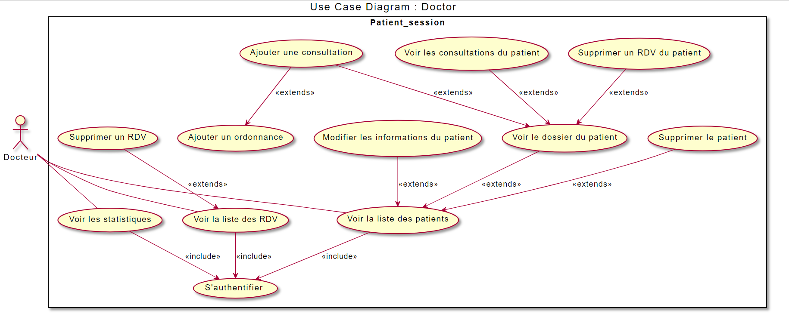
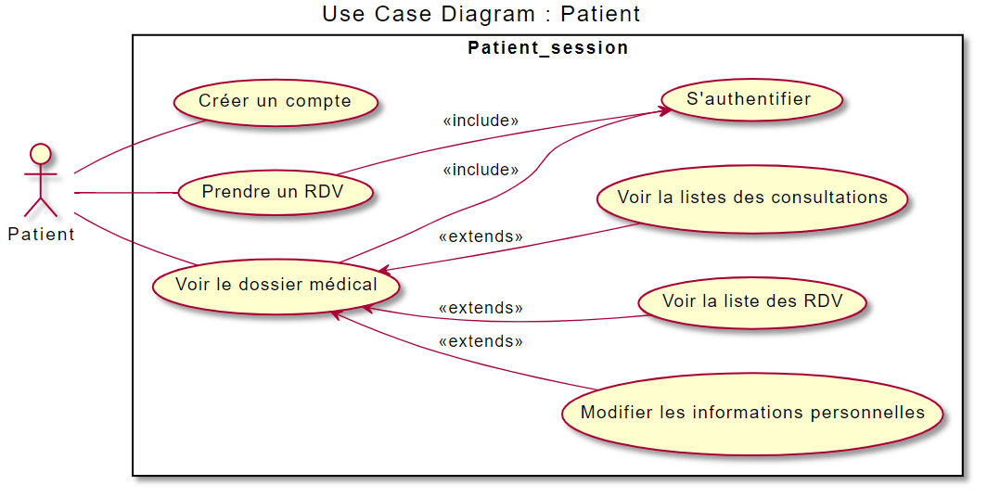
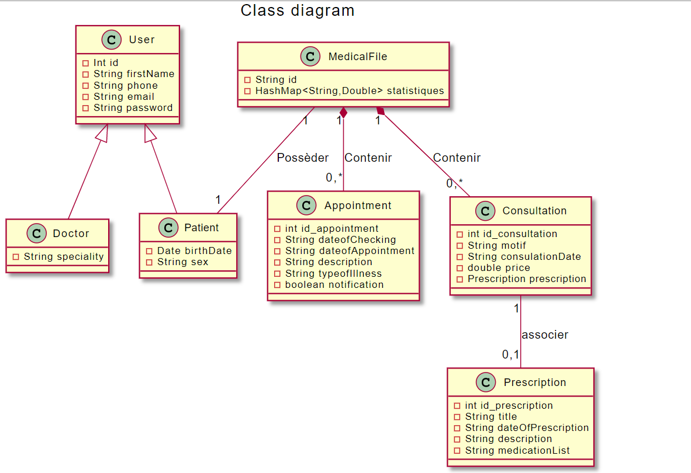

# ***Application de gestion de cabinet médical***
### **Objectif du projet:**
Le but de ce projet est de concevoir et de développer une application qui permet la gestion d'un cabinet médical(Prise des rendez-vous en ligne,gestion des patients...),en utlisant la plateforme de développement JAVA EE.

# ***Medical Office Management Application***
### **Project Objective:**
The aim of this project is to design and develop an application that enables medical office management (online appointment booking, patient management...) using the JAVA EE development platform.

---
### **Outils de développement / Development Tools**

<table>
    <thead>
        <th>Front-end</th>
        <th>Back-end</th>
        <th>Conception</th>
        <th>Autres</th>
    </thead>
    <tbody>
        <tr>
            <td>HTML</td>
            <td>Java EE (Tomcat server,Servlet,Jsp,MVC,DAO,JUnit)</td>
            <td><a href="https://www.planttext.com/">planttext</a></td>
            <td>Git/Github</td>
        </tr>
        <tr>
            <td>CSS</td>
            <td>MySQL (SGBD)</td>
            <td></td>
            <td>Docker</td>
        </tr>
        <tr>
            <td>Javascript</td>
            <td></td>
            <td></td>
            <td>Docker-compose</td>
        </tr>
        <tr>
            <td>Bootstrap</td>
            <td></td>
            <td></td>
            <td></td>
        </tr>
    </tbody>
</table>

## Architecture du Projet / Project Architecture

### Diagramme de cas d'utilisation - Médecin / Use Case Diagram - Doctor


### Diagramme de cas d'utilisation - Patient / Use Case Diagram - Patient


### Diagramme de Classes / Class Diagram


## Structure du Projet / Project Structure
```
├── src/
│   └── com/
│       ├── controllers/
│       ├── models/
│       ├── dao/
│       └── utils/
├── WebContent/
│   ├── WEB-INF/
│   ├── css/
│   ├── js/
│   └── views/
└── docs/
    └── diagrams/
```

## Installation et Déploiement / Installation and Deployment

### Prérequis / Prerequisites
- Docker Desktop
- Git

### Instructions d'installation / Setup Instructions

1. Cloner le dépôt / Clone the repository:
```bash
git clone <repository-url>
```

2. Naviguer vers le répertoire du projet / Navigate to project directory:
```bash
cd cabinet
```

3. Lancer l'application / Launch the application:
```bash
docker compose -f 'docker-compose.yml' up -d --build
```

4. Accéder à l'application / Access the application:
```
http://localhost:8080
```

## Fonctionnalités / Features
- Gestion des rendez-vous en ligne / Online appointment management
- Gestion des patients / Patient management
- Gestion des dossiers médicaux / Medical records management
- Gestion des consultations / Consultation management
- Système de prescription / Prescription system
- Statistiques et rapports / Statistics and reporting

## Documentation
La documentation détaillée et les références API se trouvent dans le répertoire `docs`.
Detailed documentation and API references can be found in the `docs` directory.

## Contribution
Pour contribuer au projet, veuillez lire le fichier [CONTRIBUTING.md](CONTRIBUTING.md).
To contribute to the project, please read [CONTRIBUTING.md](CONTRIBUTING.md).

## Licence / License
Ce projet est sous licence MIT - voir le fichier [LICENSE](LICENSE) pour plus de détails.
This project is licensed under the MIT License - see the [LICENSE](LICENSE) file for details.